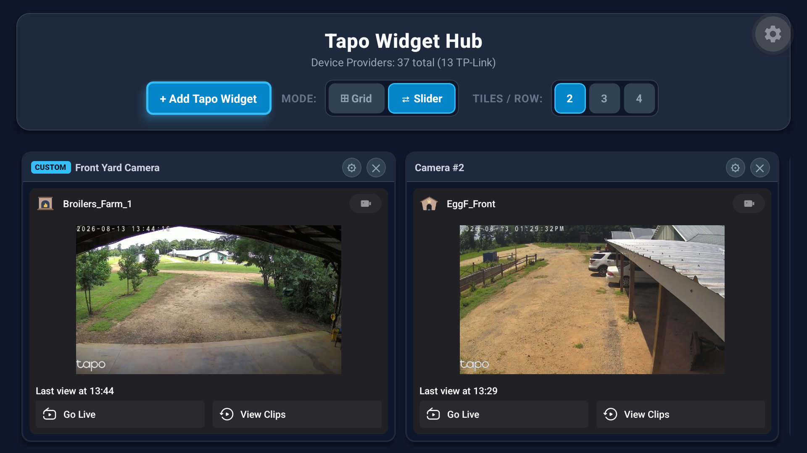

# Tapo Widget Hub (`com.widgetlauncher`)



`Tapo Widget Hub` is a custom, high-performance Android TV Launcher built with **Expo (SDK 57 dev client)** and **React Native (0.86)**, featuring a native **Kotlin bridge** that embeds live Android `AppWidget` instances directly into the television UI.

Targeted for streaming media devices such as the **Onn 4K Streaming Box** (Android 14 / API 34), `Tapo Widget Hub` transforms standard Android TV into a unified smart home surveillance and widget dashboard with complete TV remote (D-Pad) control.

---

## Key Features

- 📹 **Direct Tapo Camera Live Stream Launch**: Selecting camera widgets triggers an immediate full-screen live view (`TapoPadVideoPlayV3Activity`) using native MotionEvent dispatching and depth-first layout tree introspection.
- 📱 **Native AppWidget Hosting**: Seamlessly hosts real Android AppWidgets (TP-Link Tapo, tinyCam PRO, Easy Voice Recorder, Grok, etc.) within React Native cards.
- 📺 **TV Remote D-Pad Navigation**: Optimized focus handling and grid navigation built specifically for Android TV remote controls.
- ⚡ **Prebuild-Resilient Config Plugin**: Custom Expo plugin ([`plugins/withLauncherManifest.js`](file:///home/thanhtuan/projects/tvlnc/plugins/withLauncherManifest.js)) guarantees `HOME`, `DEFAULT`, `LEANBACK_LAUNCHER` intent filters and permissions (`QUERY_ALL_PACKAGES`, `BIND_APPWIDGET`) survive `npx expo prebuild`.
- 🚀 **Automated 1-Command Deployment**: Single script ([`scripts/deploy.sh`](file:///home/thanhtuan/projects/tvlnc/scripts/deploy.sh)) handles ADB connection, display density optimization (`wm density 309`), installation, silent widget binding (`appwidget grantbind`), and HOME launcher role assignment.

---

## Tech Stack & Architecture

- **Framework**: React Native 0.86.2 + Expo SDK ~57.0.11 (Custom Dev Client)
- **Language**: TypeScript (JS) / Kotlin (Native Android)
- **Target OS**: Android TV (Android 14 / API 34)
- **Native Bridge**:
  - [`AppWidgetHostManager.kt`](file:///home/thanhtuan/projects/tvlnc/android/app/src/main/java/com/widgetlauncher/widgethost/AppWidgetHostManager.kt) — AppWidget ID lifecycle & Activity listening binding.
  - [`AppWidgetViewManager.kt`](file:///home/thanhtuan/projects/tvlnc/android/app/src/main/java/com/widgetlauncher/widgethost/AppWidgetViewManager.kt) — ViewManager rendering host views & handling click token dispatches.
  - [`AppWidgetModule.kt`](file:///home/thanhtuan/projects/tvlnc/android/app/src/main/java/com/widgetlauncher/widgethost/AppWidgetModule.kt) — Provider enumeration native module (`getInstalledProviders()`).

---

## Quick Start

### Prerequisites

1. **Development Environment (Ubuntu/Linux/macOS)**:
   - Node.js (v18+) & npm
   - JDK 17+
   - Android SDK & Platform Tools (`adb`)
2. **Target Device**:
   - Onn 4K Box (or Android TV device) connected to the same Wi-Fi network.
   - ADB Network Debugging enabled in Developer Options.

### Build & Deploy

```bash
# 1. Install dependencies
npm install

# 2. Prebuild Android project with Expo config plugin
npx expo prebuild -p android

# 3. Assemble debug APK
cd android && ./gradlew assembleDebug && cd ..

# 4. Deploy to target device over network ADB (replace IP with target TV IP)
./scripts/deploy.sh 192.168.1.67:5555
```

---

## Repository Structure

```text
├── android/                   # Generated Android native project (managed via Expo prebuild)
├── assets/                    # Static assets & images
├── docs/                      # Technical documentation & runbooks
│   ├── README.md              # Master documentation index
│   ├── ARCHITECTURE.md        # Architectural design & native bridge guide
│   ├── WIDGET_MEDIA_ROW_FEATURE.md # Specification for cinematic 16:9 widget media rows
│   ├── RUNBOOK.md             # Step-by-step device deployment & setup guide
│   ├── TROUBLESHOOTING.md    # Diagnostic & troubleshooting guide
│   ├── TAPO_CAMERA_LIVE_VIEW_FEATURE.md # Detailed spec for Tapo Live View launch mechanism
│   ├── agent.md               # AI agent guidelines & strict constraints
│   └── implementation.md      # Sprint breakdown & implementation roadmap
├── plugins/
│   ├── withLauncherManifest.js # Config plugin injecting HOME launcher intent filters & permissions
│   └── withNativeWidgetHost.js # Config plugin managing native Kotlin bridge source sync
├── scripts/
│   └── deploy.sh              # Multi-device network ADB deployment script
├── src/
│   ├── components/
│   │   ├── WidgetCard.tsx     # Generic React Native card rendering native AppWidget views
│   │   └── TapoProviderPickerModal.tsx # TV D-Pad modal for picking installed Tapo widgets
│   ├── screens/
│   │   └── HomeScreen.tsx     # TV home screen grid, D-Pad focus handling & modal popups
│   └── services/
│       └── WidgetProviderService.ts # Service interfacing with native provider enumeration module
└── package.json               # Dependencies & scripts
```

---

## Documentation Guide

- 📚 **[`docs/README.md`](file:///home/thanhtuan/projects/tvlnc/docs/README.md)**: Master documentation index.
- 🏗️ **[`docs/ARCHITECTURE.md`](file:///home/thanhtuan/projects/tvlnc/docs/ARCHITECTURE.md)**: Native bridge design, lifecycle details, and config plugin mechanics.
- 📺 **[`docs/CHANNEL_PROPOSAL_PLAN.md`](file:///home/thanhtuan/projects/tvlnc/docs/CHANNEL_PROPOSAL_PLAN.md)**: Architectural proposal & roadmap for Android TV System Preview Channels (`androidx.tvprovider`).
- 📋 **[`docs/PROJECT_AUDIT_AND_STATUS.md`](file:///home/thanhtuan/projects/tvlnc/docs/PROJECT_AUDIT_AND_STATUS.md)**: Comprehensive technical audit report (permissions, native bridge inventory, build/signing, device state, and readiness matrix).
- 📖 **[`docs/RUNBOOK.md`](file:///home/thanhtuan/projects/tvlnc/docs/RUNBOOK.md)**: Hardware setup and repeatable 1-command deployment guide.
- 🛠️ **[`docs/TROUBLESHOOTING.md`](file:///home/thanhtuan/projects/tvlnc/docs/TROUBLESHOOTING.md)**: Diagnostic commands, logcat tips, and common issue resolution.
- 📹 **[`docs/TAPO_CAMERA_LIVE_VIEW_FEATURE.md`](file:///home/thanhtuan/projects/tvlnc/docs/TAPO_CAMERA_LIVE_VIEW_FEATURE.md)**: Technical breakdown of Tapo camera live stream dispatching.
- 📝 **[`docs/agent.md`](file:///home/thanhtuan/projects/tvlnc/docs/agent.md)**: AI agent instructions & mandatory hard constraints.
- 📋 **[`docs/implementation.md`](file:///home/thanhtuan/projects/tvlnc/docs/implementation.md)**: Historical sprint backlog and roadmap.
- 🧭 **[`docs/TAPO_DASHBOARD_IMPLEMENTATION_PLAN.md`](file:///home/thanhtuan/projects/tvlnc/docs/TAPO_DASHBOARD_IMPLEMENTATION_PLAN.md)**: Current phased plan for full installed-Tapo-widget coverage.
- 📍 **[`docs/DEVELOPMENT_LOG.md`](file:///home/thanhtuan/projects/tvlnc/docs/DEVELOPMENT_LOG.md)**: Current branch status, validation evidence, and the next resume point for future sessions.

---

## License

Private Project — All Rights Reserved.
