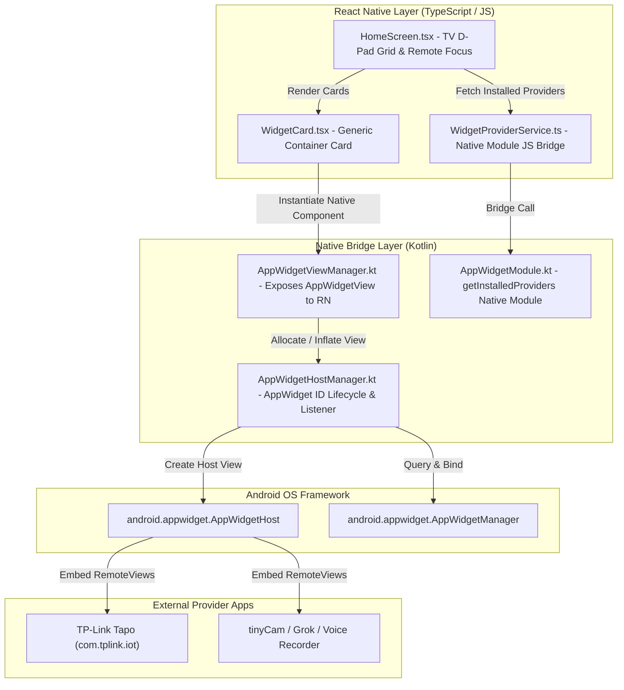
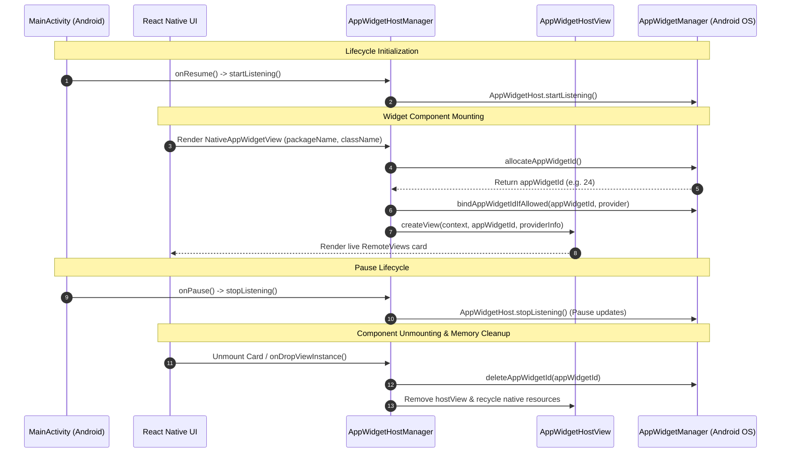
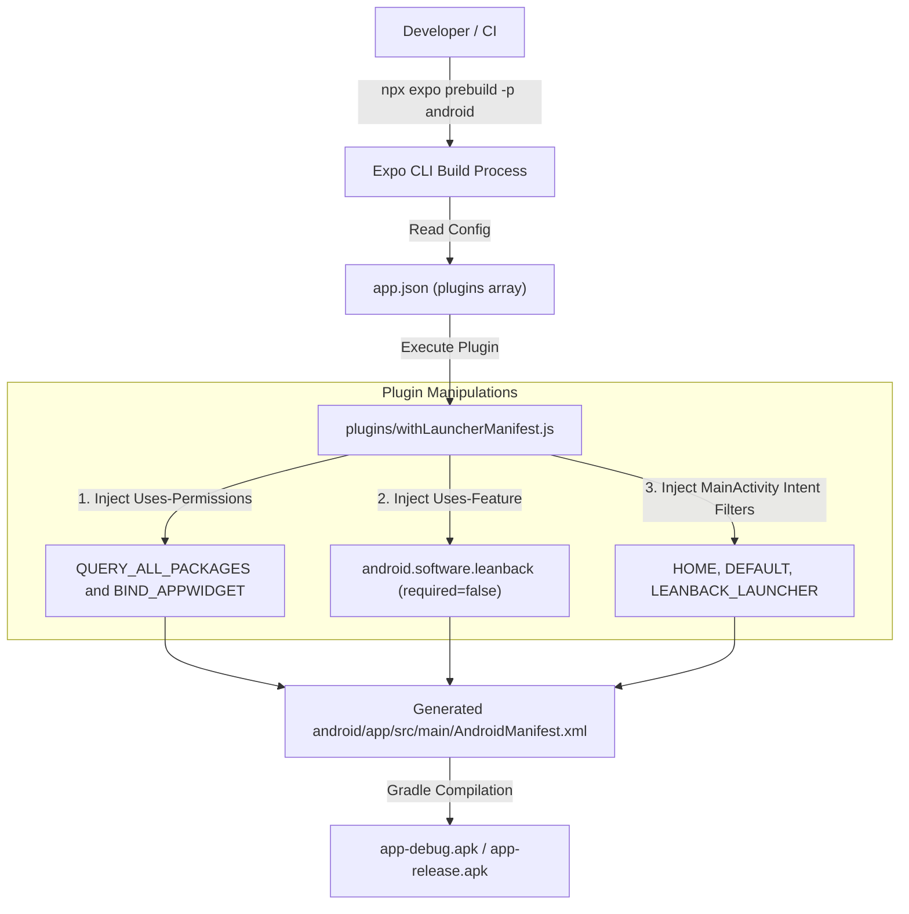

# Architecture Specification — TV Launcher (`com.tvlauncher`)

This document outlines the software architecture, native module bridge design, view lifecycle management, and build configuration system powering `tvlauncher`.

---

## 1. High-Level Architecture Overview

`tvlauncher` is designed as a hybrid Android TV application. The user interface and TV navigation are implemented in **React Native**, while live widget hosting, provider enumeration, and motion event dispatching are powered by a custom **Kotlin Native Bridge**.



---

## 2. React Native UI & TV Remote Navigation Layer

### 2.1 Focus & D-Pad Remote Handling
Standard mobile touch interactions do not apply on Android TV. `tvlauncher` uses React Native's TV focus management:
- **`TouchableOpacity` / `Pressable`**: Styled with dynamic focus borders (`borderColor`, `scale` transformations) triggered via `onFocus` and `onBlur`.
- **`hasTVPreferredFocus`**: Assigned to the primary active card on initial mount to ensure immediate remote usability upon booting.
- **TV Grid Navigation**: Layout grid calculated dynamically to ensure smooth directional D-Pad jumping across widget cards.

### 2.2 Generic Component Pattern (`WidgetCard.tsx`)
`tvlauncher` strictly avoids per-widget hardcoded components. Instead, [`WidgetCard.tsx`](file:///home/thanhtuan/projects/tvlnc/src/components/WidgetCard.tsx) accepts generic props:
```typescript
interface WidgetCardProps {
  packageName: string;
  className: string;
  label: string;
  clickToken: number;
  onPress: () => void;
}
```
When selected via remote keypress (OK / Select), `WidgetCard` increments `clickToken`, which triggers native click dispatching down in Kotlin.

---

## 3. Native Kotlin Bridge Architecture

The native bridge resides under `android/app/src/main/java/com/tvlauncher/widgethost/`.

### 3.1 AppWidgetHostManager (`AppWidgetHostManager.kt`)
Singleton manager responsible for `AppWidgetHost` initialization and activity lifecycle tracking:
- **Host ID**: Initialized with host ID `1024`.
- **Lifecycle Integration**:
  - `startListening()`: Called when the main activity enters `onResume` state to enable live widget updates.
  - `stopListening()`: Called in `onPause` to prevent unnecessary background rendering/battery drain.
- **ID Allocation & Deletion**:
  - `allocateAppWidgetId()`: Requests a new unique widget ID from `AppWidgetHost`.
  - `deleteAppWidgetId(id)`: Releases allocated widget IDs on view unmount to prevent native memory leaks.

### 3.2 AppWidgetViewManager (`AppWidgetViewManager.kt`)
Extends React Native's `SimpleViewManager<AppWidgetViewContainer>`:
- **Exposed Name**: `"AppWidgetView"`
- **Properties (`@ReactProp`)**:
  - `packageName`: Target widget package (e.g. `com.tplink.iot`).
  - `className`: Target widget provider component class.
  - `clickToken`: Triggers view tree click traversal when incremented.
- **View Inflation & Mounting**:
  1. Requests provider info from `AppWidgetManager`.
  2. Binds widget ID silently using pre-granted `grantbind` permissions.
  3. Inflates `AppWidgetHostView` into container frame.
- **View Cleanup**: Widget IDs are deliberately retained through ordinary React Native unmounts so persisted cards can remount with the same ID. The dashboard explicitly calls `deleteAppWidgetId()` when a user removes a widget.

### 3.3 AppWidgetModule (`AppWidgetModule.kt`)
Native module extending `ReactContextBaseJavaModule`:
- **Exposed Function**: `getInstalledProviders(promise: Promise)`
- **Execution**: Queries `AppWidgetManager.getInstalledProviders()`, filtering for installed Android AppWidgets, and resolves a JSON payload containing `packageName`, `className`, and `label`.

### 3.4 Widget Lifecycle & Native Resource Cleanup

To prevent native memory leaks and orphaned widget IDs, the native bridge coordinates widget allocation and deletion across Activity states and React Native view lifecycles:



---

## 4. Security & RemoteViews Click Dispatching

### 4.1 SecurityException Bypass Strategy
External provider components (such as TP-Link Tapo's `WidgetClickActivity`) set `exported="false"` in their Android Manifest, preventing direct intent launches from third-party launchers.

To open direct camera streams without permission errors, `AppWidgetViewContainer` performs internal event dispatching:

```
[User Presses OK Remote Key]
            │
            ▼
[RN Increments clickToken]
            │
            ▼
[@ReactProp setClickToken()]
            │
            ▼
[Primary: Depth-First Search Tree Introspection]
  └── Search hostView children for target ImageView -> performClick()
            │
      (If not found)
            ▼
[Secondary: Fallback Coordinate Math]
  └── Construct MotionEvent (ACTION_DOWN + ACTION_UP)
  └── Target: (x = width * 0.5f, y = height * 0.6f)
  └── dispatchTouchEvent() -> Triggers attached PendingIntent cleanly
```

For full details and empirical log trace evidence, refer to [`TAPO_CAMERA_LIVE_VIEW_FEATURE.md`](file:///home/thanhtuan/projects/tvlnc/docs/TAPO_CAMERA_LIVE_VIEW_FEATURE.md).

---

## 5. Expo Config Plugin Mechanics (`plugins/withLauncherManifest.js`)

To keep the codebase maintainable, native Android Manifest edits are **never made by hand**. Hand edits are erased during `npx expo prebuild`.

The custom plugin [`withLauncherManifest.js`](file:///home/thanhtuan/projects/tvlnc/plugins/withLauncherManifest.js) hooks into `@expo/config-plugins`:

```javascript
module.exports = function withLauncherManifest(config) {
  return withAndroidManifest(config, async (config) => {
    // 1. Inject permissions: QUERY_ALL_PACKAGES & BIND_APPWIDGET
    // 2. Inject feature: android.software.leanback (required=false)
    // 3. Inject MainActivity Intent Filters:
    //    - android.intent.category.HOME
    //    - android.intent.category.DEFAULT
    //    - android.intent.category.LEANBACK_LAUNCHER
    return config;
  });
};
```

This guarantees that deleting `android/` and re-running `npx expo prebuild` produces a 100% functional native build without manual intervention.

### 5.1 Config Plugin Build Pipeline


