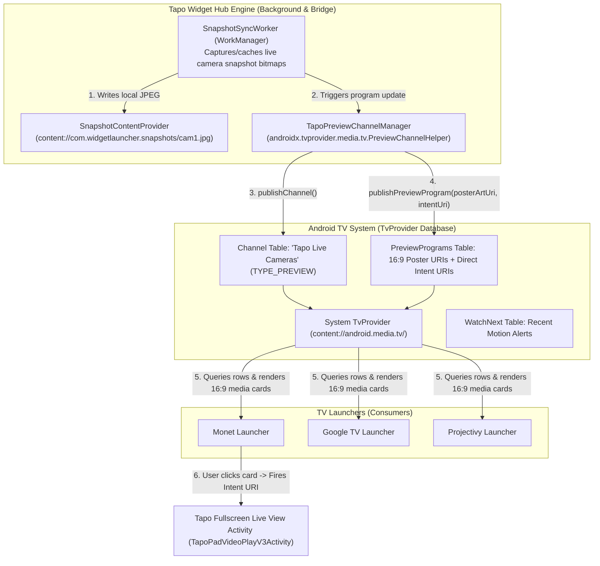

# Architecture Proposal: Android TV Preview Channels & Recommendations for Tapo

**Project**: `Tapo Widget Hub` (`com.widgetlauncher`)  
**Target Platform**: Android TV / Google TV (API 34 / Android 14, Onn 4K Pro & Standard Streaming Boxes)  
**Author**: Engineering Team  
**Date**: August 2026  
**Status**: Proposal & Implementation Roadmap  

---

## 1. Executive Summary & Objective

### 1.1 The Vision
Modern Android TV launchers (including **Google TV**, **Monet Launcher**, and **Projectivy Launcher**) feature horizontal **Media Recommendation Rows** powered by the Android TV `TvProvider` (`androidx.tvprovider`).

While streaming services like YouTube, Netflix, and Pluto TV use this framework to publish video recommendation cards, **smart home ecosystems (like TP-Link Tapo) have never supported TV Preview Channels**. 

This proposal specifies how `Tapo Widget Hub` will act as a **System Channel Publisher**, transforming live TP-Link Tapo camera feeds and smart home controls into **First-Class Android TV Preview Channels** that appear directly on Google TV, Monet Launcher, and third-party TV home screens.

```
+─────────────────────────────────────────────────────────────────────────────────────────────────────────────+
|  📷 Tapo Live Cameras (Android TV System Preview Channel)                                                    |
|                                                                                                             |
|  +───────────────────────────+  +───────────────────────────+  +───────────────────────────+  +──────────+ |
|  | [ 16:9 SNAPSHOT ARTWORK ] |  | [ 16:9 SNAPSHOT ARTWORK ] |  | [ 16:9 SNAPSHOT ARTWORK ] |  | [ ALL ]  | |
|  |                           |  |                           |  |                           |  |          | |
|  | ───────────────────────── |  | ───────────────────────── |  | ───────────────────────── |  | Open     | |
|  | Front Yard Cam • LIVE     |  | Backyard Cam • LIVE       |  | Living Room Cam • LIVE    |  | Tapo Hub | |
|  +───────────────────────────+  +───────────────────────────+  +───────────────────────────+  +──────────+ |
|    (Click -> Fullscreen Live)     (Click -> Fullscreen Live)     (Click -> Fullscreen Live)                 |
+─────────────────────────────────────────────────────────────────────────────────────────────────────────────+
```

---

## 2. End-to-End System Architecture



---

## 3. Core Technical Pillars

### 3.1 Preview Channel Definition (`PreviewChannel`)
`Tapo Widget Hub` creates and publishes a persistent preview channel:
* **Display Name**: `"Tapo Live Cameras"`
* **Description**: `"Real-time security camera previews from TP-Link Tapo"`
* **Package Name**: `com.widgetlauncher`
* **Channel Type**: `TvContractCompat.Channels.TYPE_PREVIEW`
* **App Icon**: Dedicated high-resolution camera badge

### 3.2 Media Cards (`PreviewProgram`)
Each camera registered in `Tapo Widget Hub` is published as a distinct 16:9 media card:
* **`COLUMN_TITLE`**: Camera Name (e.g., `"Front Yard Camera"`).
* **`COLUMN_SHORT_DESCRIPTION`**: Connection status or resolution (e.g., `"1080p Full HD • Live"`).
* **`COLUMN_POSTER_ART_URI`**: Secure `content://` URI pointing to `SnapshotContentProvider` (`content://com.widgetlauncher.snapshots/front_yard.jpg`).
* **`COLUMN_POSTER_ART_ASPECT_RATIO`**: `TvContractCompat.PreviewPrograms.ASPECT_RATIO_16_9`.
* **`COLUMN_INTENT_URI`**: Direct deep-link intent string launching `TapoPadVideoPlayV3Activity` or `widget-hub://live?id=...`.

### 3.3 Secure Snapshot Content Provider (`SnapshotContentProvider.kt`)
Because external TV launchers (Monet, Google TV) run in separate sandboxed processes, they cannot read private app storage files.
* A custom `FileProvider` / `ContentProvider` exposes cached 16:9 camera snapshots via `content://com.widgetlauncher.snapshots/*`.
* Configured with `android:grantUriPermissions="true"` and `android:exported="true"`.

### 3.4 Background Snapshot Sync Worker (`SnapshotSyncWorker.kt`)
* Implemented using Android `WorkManager`.
* Periodically requests updated preview snapshots from bound Tapo widget `RemoteViews` or cached camera snapshots.
* Updates `TvContractCompat.PreviewPrograms` rows so the TV launcher home screen displays fresh snapshots.

---

## 4. Complementary Strategy: System Channels vs In-App Media Row

| Feature Dimension | System Preview Channels (This Proposal) | In-App Cinematic Media Row ([`CINEMATIC_WIDGET_MEDIA_ROW_RFC.md`](./CINEMATIC_WIDGET_MEDIA_ROW_RFC.md)) |
|---|---|---|
| **Host Environment** | Third-party TV Launchers (Monet, Google TV, Projectivy). | `Tapo Widget Hub` (When running as the primary HOME launcher). |
| **Data Protocol** | Android TV `TvContract.PreviewPrograms` & `androidx.tvprovider`. | Android `AppWidgetHost` & Native `RemoteViews` embedding. |
| **Media Card Content** | High-resolution 16:9 snapshot images with deep links. | Real-time interactive smart home widgets (live feeds, interactive switches). |
| **User Value** | Allows users who prefer Monet or Google TV to see Tapo cameras on their home screen. | Complete dedicated TV dashboard for active widget hosting and TV remote D-Pad controls. |

---

## 5. Phased Implementation Roadmap

```
+─────────────────────────────────────────────────────────────────────────────────────────────+
| Phase 1: Build & Plugin Setup                                                               |
| • Add androidx.tvprovider:tvprovider:1.0.0 & androidx.work:work-runtime-ktx                 |
| • Create plugins/withPreviewChannels.js Expo config plugin                                  |
+─────────────────────────────────────────────────────────────────────────────────────────────+
                                              │
                                              ▼
+─────────────────────────────────────────────────────────────────────────────────────────────+
| Phase 2: Native Snapshot Provider & Channel Publisher                                       |
| • Implement SnapshotContentProvider.kt (secure 16:9 image serving)                          |
| • Implement TapoPreviewChannelManager.kt (Channel & Program CRUD operations)                |
+─────────────────────────────────────────────────────────────────────────────────────────────+
                                              │
                                              ▼
+─────────────────────────────────────────────────────────────────────────────────────────────+
| Phase 3: Background Snapshot Sync Worker                                                    |
| • Implement SnapshotSyncWorker.kt using WorkManager for periodic snapshot updates          |
| • Wire refresh triggers on widget update broadcasts                                         |
+─────────────────────────────────────────────────────────────────────────────────────────────+
                                              │
                                              ▼
+─────────────────────────────────────────────────────────────────────────────────────────────+
| Phase 4: Intent URI & Deep Link Bridge                                                      |
| • Generate direct TapoPadVideoPlayV3Activity Intent URIs                                    |
| • Request browsable channel prompt (TvContractCompat.requestChannelBrowsable)               |
+─────────────────────────────────────────────────────────────────────────────────────────────+
                                              │
                                              ▼
+─────────────────────────────────────────────────────────────────────────────────────────────+
| Phase 5: Device Validation on Hardware (Onn 4K Box)                                         |
| • Verify channel appears in Monet Launcher / Google TV home screen                          |
| • Test D-Pad click execution to launch full-screen camera stream                            |
+─────────────────────────────────────────────────────────────────────────────────────────────+
```

---

## 6. Verification Checklist & Success Criteria

- [ ] **Channel Registration**: `"Tapo Live Cameras"` row appears in the channel configuration list on Monet Launcher and Google TV.
- [ ] **16:9 Card Rendering**: Preview cards display crisp 16:9 camera snapshots with title overlays.
- [ ] **One-Click Launch**: Pressing OK on a card in Monet Launcher immediately opens `TapoPadVideoPlayV3Activity` full-screen.
- [ ] **Prebuild Resilience**: All manifest entries and Gradle dependencies survive clean `npx expo prebuild -p android`.
