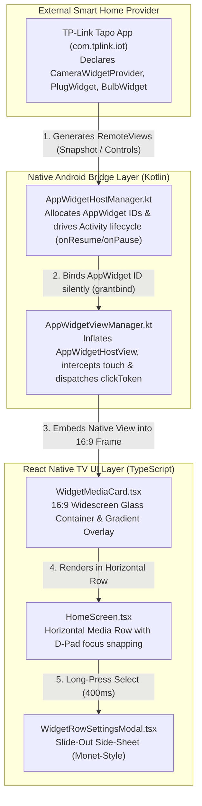

# RFC: Tapo TV Widget Launcher — Cinematic Media Card Rows (Monet-Style)

**Feature**: Android TV Widget-as-Media-Card Architecture  
**Target Platform**: Android TV / Google TV (API 34 / Android 14, Onn 4K Pro / Streaming Devices)  
**Package**: `com.widgetlauncher` (`Tapo Widget Hub`)  
**Status**: Authoritative Architectural RFC & Feature Design  
**Author**: Engineering Team  
**Date**: August 2026  

---

## 1. Executive Summary & Root Motivation

### 1.1 The Android TV Platform Limitation
On standard Android mobile and tablet devices, Android `AppWidget` is a primary user interface paradigm. However, **Android TV OS and Google TV intentionally hide, suppress, and disable the native AppWidget system**:
* Android TV provides no widget workspace, no widget picker, and no home screen widget hosting.
* As a result, smart home ecosystems like **TP-Link Tapo (`com.tplink.iot`)**—which bundle rich Android widgets for live camera previews, smart plug toggles, bulb dimmers, and sensors—are completely inaccessible on television screens.

### 1.2 The Core Purpose of Tapo Widget Hub
`Tapo Widget Hub` is a dedicated Android TV Launcher built to restore widget capability to Android TV devices. By running as a custom Leanback `HOME` launcher, it hosts live Android `AppWidget` instances natively using a Kotlin `AppWidgetHost` bridge with silent binding (`appwidget grantbind`).

### 1.3 The Core Concept: Widgets as TV Media Cards
Instead of displaying widgets inside a clumsy mobile-style grid or an isolated utility app, this feature **models Tapo widgets directly as First-Class Android TV Media Cards**, visually and behaviorally identical to **YouTube recommendation cards in modern TV launchers like Monet**:

```
+─────────────────────────────────────────────────────────────────────────────────────────────────────────────+
|  📺 Tapo Smart Home (Media Row Header)                                                                      |
|                                                                                                             |
|  +───────────────────────────+  +───────────────────────────+  +───────────────────────────+  +──────────+ |
|  | [ LIVE CAMERA REMOTE-VIEW ]|  | [ LIVE CAMERA REMOTE-VIEW ]|  | [ SMART PLUG REMOTE-VIEW ]|  |    +     | |
|  |                           |  |                           |  |                           |  |   Add    | |
|  |                           |  |                           |  |                           |  |  Widget  | |
|  | ───────────────────────── |  | ───────────────────────── |  | ───────────────────────── |  |   Card   | |
|  | Front Yard Cam • LIVE     |  | Backyard Cam • LIVE       |  | Living Room Plug • ON     |  |          | |
|  +───────────────────────────+  +───────────────────────────+  +───────────────────────────+  +──────────+ |
|     16:9 Widescreen Card           16:9 Widescreen Card           16:9 Widescreen Card                      |
+─────────────────────────────────────────────────────────────────────────────────────────────────────────────+
```

---

## 2. Interaction Parity: YouTube Media Card vs. Tapo Widget Card

| Behavior | YouTube Media Row (Monet Launcher) | Tapo Widget Media Row (`Tapo Widget Hub`) |
|---|---|---|
| **Visual Form Factor** | 16:9 widescreen rounded cards (`borderRadius: 18`) with edge-to-edge artwork. | **16:9 widescreen rounded cards** embedding live `AppWidgetHostView` `RemoteViews`. |
| **Primary Interaction (D-Pad Select / OK)** | Immediately launches full-screen video playback in YouTube. | **Immediately launches full-screen Live Camera Stream** (`TapoPadVideoPlayV3Activity`) or toggles plug state in-place. |
| **Remote Focus Physics** | Focus scale `1.05x`, glowing accent border (`#38BDF8`), smooth D-Pad jumping. | **Focus scale `1.05x`**, glowing cyan ring, elevation, and seamless horizontal D-Pad traversal. |
| **Title & Artwork Presentation** | Video title overlay with option to *"Hide titles"* for pure artwork. | **Device label overlay** with toggleable *"Hide titles"* mode for pure live camera viewports. |
| **Row Configuration (Long Press)** | Right-aligned slide-out modal panel (density, displayed cards, renaming). | **Right-aligned slide-out modal drawer** (cards per row, title toggle, custom renaming, click actions). |

---

## 3. End-to-End System Architecture



---

## 4. Detailed Technical Implementation

### 4.1 16:9 Aspect Ratio & Container Math (`WidgetMediaCard.tsx`)
Unlike static image thumbnails, `AppWidget` layouts (`RemoteViews`) are flexible Android layouts. To render them as 16:9 widescreen media cards without distortion:

1. **Dynamic TV Density Math**:
   $$\text{availableWidth} = \text{screenWidth} - 2 \times \text{horizontalPadding}$$
   $$\text{cardWidth} = \frac{\text{availableWidth} - (\text{cardsPerRow} - 1) \times \text{gap}}{\text{cardsPerRow}}$$
   $$\text{cardHeight} = \text{cardWidth} \times \frac{9}{16}$$

2. **Edge-to-Edge Clipping & Normalization**:
   - Card container: `borderRadius: 18`, `overflow: 'hidden'`, `backgroundColor: '#121620'`.
   - In native Kotlin, OS-level default widget padding is stripped (`setPadding(0, 0, 0, 0)`), ensuring the camera snapshot or plug button fills the 16:9 card edge-to-edge.

3. **Bottom Gradient Typographic Overlay**:
   - Linear gradient bar (`#000000D0` to `transparent`) at the bottom of the card.
   - Displays device name (e.g. `Front Yard Camera`) and connection/state badge.
   - Controlled by the user-configurable `hideTitles` flag.

### 4.2 TV D-Pad Remote Navigation & Gesture Interception
Android `AppWidgetHostView` instances can swallow motion and key events before React Native's `<Pressable>` registers gestures.

1. **Touch Interception in Native Kotlin** ([`plugins/widgethost/AppWidgetViewManager.kt`](file:///home/thanhtuan/projects/tvlnc/plugins/widgethost/AppWidgetViewManager.kt)):
   ```kotlin
   class AppWidgetViewContainer(context: Context, private val hostManager: AppWidgetHostManager) : FrameLayout(context) {
     // Ensure touch & click events bubble up cleanly to React Native Pressable handlers
     override fun onInterceptTouchEvent(ev: MotionEvent?): Boolean = true
   }
   ```

2. **D-Pad Key Event Handling** ([`src/components/WidgetMediaCard.tsx`](file:///home/thanhtuan/projects/tvlnc/src/components/WidgetMediaCard.tsx)):
   - **Short Press (Select / OK)**: Increments `clickToken` $\rightarrow$ Kotlin executes DFS tree introspection & coordinate touch dispatch $\rightarrow$ **Launches Full-Screen Camera Live View (`TapoPadVideoPlayV3Activity`)** or toggles smart plug.
   - **Long Press (400ms Hold)**: Opens the **Slide-Out Media Row Customizer Drawer**.

### 4.3 Slide-Out Customizer Side-Sheet (`WidgetRowSettingsModal.tsx`)
A right-aligned slide-out modal panel inspired by Monet Launcher's YouTube row configuration:

```
+─────────────────────────────────────────────────────────────+
|                                    Tapo Surveillance        |
|                                    Media row settings       |
|                                                             |
|  [📷] Row Visibility               (▲)  (▼)  [ (•) ON ]     |
|       Show or hide this smart home row                      |
|                                                             |
|  [📺] Displayed cards                             4 cards > |
|                                                             |
|  [⊞] Media cards per row                        3 per row > |
|      (2 per row, 3 per row, 4 per row)                      |
|                                                             |
|  [TT] Hide titles                                [ (•) ON ] |
|       Show only artwork without text overlay                |
|                                                             |
|  [T]  Show row name                             [ (•) ON ]  |
|                                                             |
|  [✎] Rename row                                           > |
|                                                             |
|  [⚙] Card Click Action                     Live Stream V3 > |
|      (Live View V3 | Open Tapo App | In-Place Toggle)       |
|                                                             |
|  [✕] Delete Widget Card                     Delete from TV  |
+─────────────────────────────────────────────────────────────+
```

---

## 5. Persistence Data Model & SharedPreferences Schema

Configuration is persisted atomically in Android `SharedPreferences` under `widgetlauncher_prefs`:

```typescript
export interface RowSettings {
  rowTitle: string;
  showRowTitle: boolean;
  cardsPerRow: 2 | 3 | 4;
  hideTitles: boolean;
}

export interface ActiveWidget {
  instanceId: string;
  appWidgetId?: number;
  packageName: string;
  className: string;
  label: string;
  customLabel?: string;
  clickAction: 'widget_primary' | 'open_tapo_app' | 'none';
}
```

---

## 6. Verification Checklist & Success Criteria

1. **TV Launcher Purpose**: The launcher boots directly into the Tapo smart home dashboard on HOME keypress, restoring the suppressed widget capabilities of Android TV.
2. **Media Row Visuals**: Widgets render inside 16:9 widescreen glassmorphism tiles with clean focus borders (`#38BDF8`) and smooth D-Pad navigation.
3. **One-Click Live Stream**: Pressing OK on a camera media card instantly launches `TapoPadVideoPlayV3Activity` full-screen.
4. **Contextual Customization**: Long-pressing any card opens the Monet-style side sheet to toggle titles, adjust cards-per-row density (2, 3, 4), rename devices, or remove cards.
5. **Native Lifecycle Safety**: Unmounting a widget card releases its native `appWidgetId` from `AppWidgetHostManager`, preventing memory leaks on streaming hardware.
