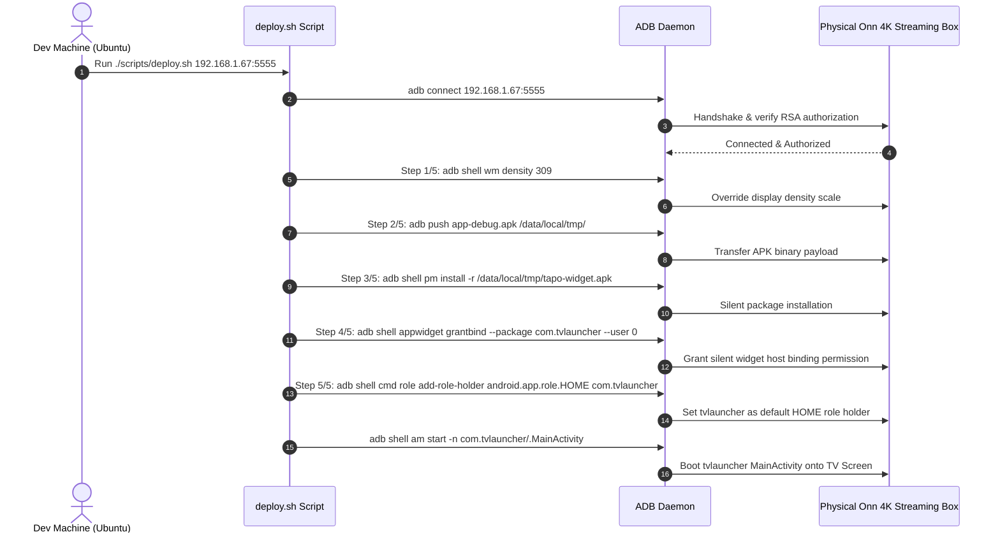

# Fresh Device Setup Runbook — TV Launcher (`com.tvlauncher`)

This runbook details the repeatable, end-to-end procedure for deploying `tvlauncher` to a brand-new or factory-reset Android TV device (e.g. Onn 4K Streaming Box).

---

## 1. Prerequisites on Development Machine (Ubuntu)

- Android SDK & Platform Tools (`adb`, `fastboot`) installed and in PATH.
- JDK 17+ installed.
- Node.js (v18+) and npm installed.
- Physical Onn 4K box connected to the same local Wi-Fi network.

---

## 2. On-Device Setup (Onn 4K Box)

1. Turn on the Onn 4K Box and complete the initial Android TV setup wizard.
2. Go to **Settings** → **System** → **About**.
3. Scroll down to **Android TV OS build** and press the **Select / OK** button 7 times until the toast message `"You are now a developer!"` appears.
4. Go back to **Settings** → **System** → **Developer options**.
5. Enable **Network debugging** / **ADB debugging**.
6. Check your device IP under **Settings** → **Network & Internet** → *(Your Wi-Fi Network)* (e.g. `192.168.1.67`).

---

## 3. Automated One-Command Deployment

On your Ubuntu dev machine, navigate to the repo root and run:

```bash
# Optional: Prebuild & compile fresh debug APK
npx expo prebuild -p android
cd android && ./gradlew assembleDebug && cd ..

# Run automated deploy script (replace IP with your target device IP)
./scripts/deploy.sh 192.168.1.67:5555
```

### Automated Deployment Sequence Diagram



### What `deploy.sh` automatically performs:
1. Connects to device ADB at target IP/port.
2. Applies display density override: `wm density 309`.
3. Pushes compiled `app-debug.apk` to `/data/local/tmp/app-debug.apk`.
4. Installs the APK silently (`pm install -r`).
5. Grants widget host binding permission silently (`appwidget grantbind --package com.tvlauncher --user 0`).
6. Assigns `tvlauncher` as default HOME launcher (`cmd role add-role-holder android.app.role.HOME com.tvlauncher`).
7. Launches `com.tvlauncher/.MainActivity`.

---

## 4. Verification & Testing Checklist

- [ ] **Home Button**: Press the **HOME** button on the TV remote. `tvlauncher` should appear immediately as the default launcher.
- [ ] **Widget Binding**: Add a Tapo camera widget using **+ Add Camera**. Select a camera in Tapo. The snapshot feed should display cleanly without any permission dialogs.
- [ ] **Live View Click**: Press **Select / OK** on a camera widget. It should open directly into full-screen live view (`TapoPadVideoPlayV3Activity`).
- [ ] **Persistence**: Restart the Onn 4K box. Reopen `tvlauncher`. The active widgets, assigned cameras, and grid/slider settings should restore automatically without binding errors.

---

## 5. Troubleshooting & Edge Cases

| Issue | Cause | Solution |
|---|---|---|
| `device offline` / `unauthorized` | Device RSA key prompt pending on TV | Check TV screen and select `"Always allow from this computer"`, then rerun `./scripts/deploy.sh`. |
| `Widget binding not allowed` | `grantbind` permission not granted | Manually run: `adb shell appwidget grantbind --package com.tvlauncher --user 0`. |
| Manifest wiped after prebuild | Manual edits to `android/AndroidManifest.xml` | Ensure all manifest edits are in `plugins/withLauncherManifest.js`, then re-run `npx expo prebuild -p android`. |
| Missing widget fallback | Target provider app (e.g. TP-Link Tapo) not installed | Install the target app via ADB or Play Store. `tvlauncher` will display a fallback card instead of crashing. |
