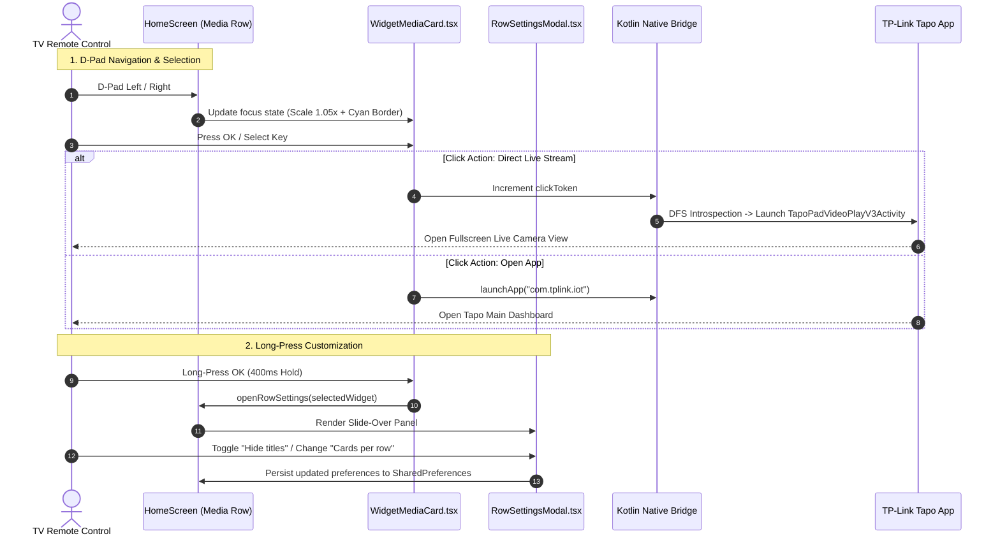

# Technical Specification: Cinematic Widget Media Row & Customizer Panel

**Project**: `Tapo Widget Hub` (`com.widgetlauncher`)  
**Target Platform**: Android TV (API 34 / Android 14, Onn 4K Streaming Box)  
**Author**: Engineering Team  
**Date**: August 2026  
**Status**: Specification & Architectural Design  

---

## 1. Executive Overview & Motivation

Traditional Android TV launchers often render widgets in basic, square grid tiles with rigid card borders. In contrast, modern streaming media dashboards (such as Android TV Recommendations rows and Monet Launcher) display **sleek, widescreen 16:9 horizontal media cards** with edge-to-edge artwork, clean typographic overlays, and slide-out customization sheets.

This feature transforms standard Android TV widget hosting by embedding **real, live Android `AppWidget` instances directly inside cinematic 16:9 horizontal media cards**. Each card functions as a live interactive smart home tile (e.g. Tapo Camera live snapshot feeds, Smart Plug toggle states, Light Bulb brightness controls) while preserving smooth TV remote D-Pad navigation.

---

## 2. Visual & Layout Architecture

```
+-------------------------------------------------------------------------------------------------------+
|  📷 Tapo Cameras (Customizable Row Name)                                                              |
|                                                                                                       |
|  +---------------------------+  +---------------------------+  +---------------------------+  +-----+ |
|  | [ LIVE CAMERA FEED ]      |  | [ LIVE CAMERA FEED ]      |  | [ SMART PLUG WIDGET ]     |  |  +  | |
|  |                           |  |                           |  |                           |  |     | |
|  |                           |  |                           |  |                           |  | Add | |
|  | ───────────────────────── |  | ───────────────────────── |  | ───────────────────────── |  | Tile| |
|  | Front Yard Camera • LIVE  |  | Backyard Camera • LIVE    |  | Living Room Plug • ON     |  |     | |
|  +---------------------------+  +---------------------------+  +---------------------------+  +-----+ |
|    (16:9 Rounded Glass Tile)      (16:9 Rounded Glass Tile)      (16:9 Rounded Glass Tile)            |
+-------------------------------------------------------------------------------------------------------+
```

---

## 3. Core Functional Requirements

### 3.1 Cinematic 16:9 Media Card (`WidgetMediaCard.tsx`)
1. **Aspect Ratio & Dimensions**:
   - Standard 16:9 widescreen ratio (`height = width * 9 / 16`).
   - Width dynamically calculated based on the active `cardsPerRow` setting (2, 3, or 4 visible per screen).
2. **Edge-to-Edge Widget Frame**:
   - `borderRadius: 18`, `overflow: 'hidden'`.
   - Dark glassmorphism background (`#121620` with subtle `#1E293B` borders).
   - Hosts native `AppWidgetView` scaled to fill the container without awkward gutters or double margins.
3. **Bottom Gradient Title Overlay**:
   - Semi-transparent gradient bar (`#000000D0` to `transparent`) positioned at the bottom of the card.
   - Clean, legible text displaying the widget's label or custom name.
   - Supports **"Hide titles"** mode: hides the text overlay to display purely edge-to-edge live camera artwork.

### 3.2 Horizontal D-Pad Media Row (`HomeScreen.tsx`)
1. **Horizontal Scroll & Snapping**:
   - Horizontal `ScrollView` with TV D-Pad focus snapping (`Left` / `Right` directional navigation).
2. **Focus Scaling & Highlights**:
   - Focused card scales smoothly to `1.05x` with an active cyan highlight border (`#38BDF8`, `borderWidth: 3`).
   - Unfocused cards retain neutral glass styling.
3. **Inline "+ Add Widget" Card**:
   - Appears at the end of the media row, allowing instant addition of new Tapo widget cards.

### 3.3 Slide-Out Customization Side-Sheet (Monet-Style Modal)
A sleek, right-aligned slide-out modal providing granular per-row and per-card customization:

| Setting | Control Type | Description |
|---|---|---|
| **Media cards per row** | 2 / 3 / 4 Selector | Adjusts horizontal density and card width. |
| **Hide titles** | Toggle Switch | Hides title overlays for a clean, artwork-only look. |
| **Show row name** | Toggle Switch | Enables or hides the category row title. |
| **Rename Row / Widget** | Text Input / Modal | Overrides default titles with custom room/device labels. |
| **Click Action** | Action Menu | Chooses behavior on Select press (Live Stream vs Open Tapo vs In-place Toggle). |
| **Delete Card** | Action Button | Safely removes widget and deletes native AppWidget ID. |

---

## 4. Interaction Flow & Sequence



---

## 5. Technical Implementation Blueprint

### 5.1 Component Structure

```text
src/
├── components/
│   ├── WidgetMediaCard.tsx        # 16:9 widescreen card hosting native AppWidgetView
│   ├── WidgetRowSettingsModal.tsx # Slide-out side-sheet for density, titles & actions
│   ├── TapoProviderPickerModal.tsx # D-Pad modal for selecting installed Tapo widgets
│   └── WidgetCard.tsx             # Legacy/Grid card component
├── screens/
│   └── HomeScreen.tsx             # Main TV launcher screen with horizontal media rows
└── services/
    └── WidgetProviderService.ts   # Native module bridge interface
```

### 5.2 Persisted Configuration Model

```typescript
export interface MediaRowConfig {
  rowTitle: string;
  showRowTitle: boolean;
  cardsPerRow: 2 | 3 | 4;
  hideTitles: boolean;
  activeWidgets: ActiveWidget[];
}

export interface ActiveWidget {
  instanceId: string;
  appWidgetId?: number;
  packageName: string;
  className: string;
  label: string;
  customLabel?: string;
  clickAction: 'widget_primary' | 'open_tapo_app' | 'none';
}
```

---

## 6. Verification Checklist

- [ ] **16:9 Aspect Ratio**: Widescreen cards scale proportionally across 720p, 1080p, and 4K displays.
- [ ] **Edge-to-Edge Widget Hosting**: RemoteViews content renders cleanly inside rounded glass tiles without clipping artifacts.
- [ ] **D-Pad Directional Navigation**: Left/Right traverses the row seamlessly; Up/Down transitions to toolbar controls.
- [ ] **Side-Sheet Options**: Toggling "Hide titles" immediately removes text overlays; changing "Cards per row" recalculates widths without unmounting widgets.
- [ ] **Direct Live Stream Execution**: Pressing Select on a camera card continues to trigger direct full-screen live view (`TapoPadVideoPlayV3Activity`).
